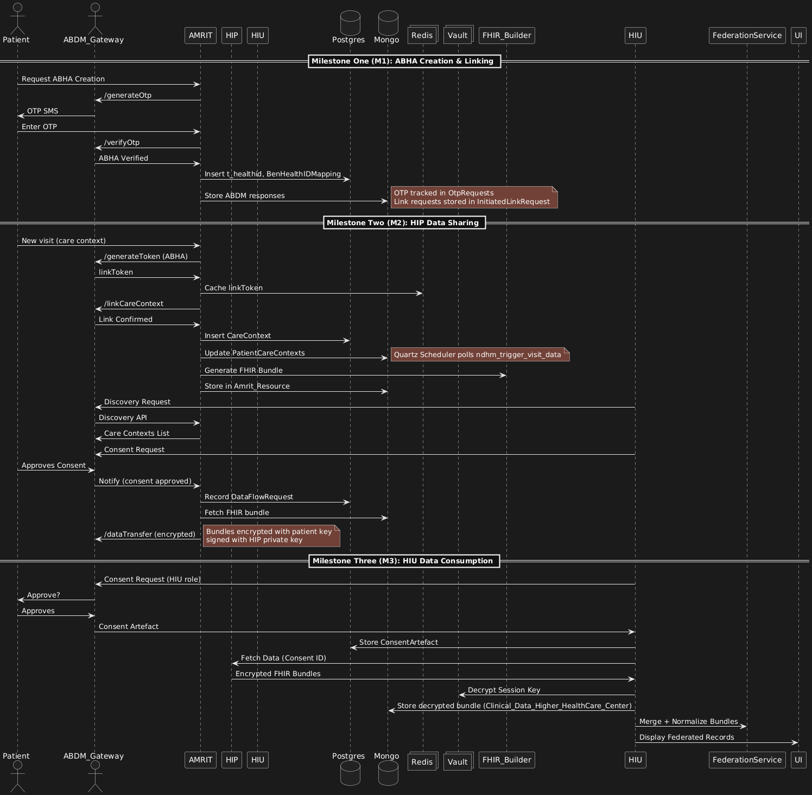

# AMRIT ↔ ABDM Integration

**Purpose**\
This documentation serves as the knowledge base for AMRIT’s integration with the **Ayushman Bharat Digital Mission (ABDM)**. It captures the technical and functional journey across sandbox milestones (M1, M2 & M3), mapping how AMRIT evolved from identity management to health data sharing, and finally to federated data consumption.

It is structured to onboard developers quickly into the system’s architecture, persistence layer, API flows, and ABDM compliance requirements. Each milestone is documented as a child page with detailed service mappings, database entities, payloads, and sandbox learnings.

## Visual Overview

<figure><figcaption></figcaption></figure>

### Integrated Milestones

#### Milestone One (M1) - ABHA & Identity Layer

* **Focus**: Identity flows - ABHA creation, verification, and sandbox-mandated OTP-based linking.
* **Key Achievements**:
  * Implemented `/generateOtp`, `/verifyOtp`, and `/createHealthID` flows.
  * Persisted ABHA identities in `t_healthid` and mappings in `m_benhealthidmapping`.
  * Implemented v0.5 OTP-based care-context linking.
  * Managed session tokens and ABDM headers in `fire-api`.
* **Persistence**:
  * **Postgres**: `OtpRequests`, `InitiatedLinkRequest`,
  * **MySQL:** `t_healthid`, `m_benhealthidmapping.`
  * **Mongo**: `GenerateTokenAbdmResponses`, `PatientCareContexts`, `NDHMResponses`.

[See Milestone One →](./#milestone-one-m1-abha-and-identity-layer)

#### Milestone Two (M2) - HIP Data Sharing

* **Focus**: AMRIT as a **Health Information Provider (HIP) -** linking contexts, generating FHIR bundles, and sharing data.
* **Key Achievements**:
  * Implemented v3 link-token flow for care-context linking.
  * Built Quartz scheduler pipeline to generate FHIR bundles.
  * Persisted bundles in Mongo (`Amrit_Resource`) for replay.
  * Implemented HIP discovery API.
  * Completed consent lifecycle: notify → dataTransfer.
* **Persistence**:
  * **Postgres**: `CareContext`, `DiscoveryRequest`, `DataFlowRequest`, `HealthInformation`, `LinkEnquiries`.
  * **Mongo**: `Amrit_Resource`, `NDHMResponses`, `PatientCareContexts`.

[See Milestone Two →](./#milestone-two-m2-hip-data-sharing)

#### Milestone Three (M3) - HIU Data Consumption

* **Focus**: AMRIT as a **Health Information User (HIU)** - consuming external health data securely with consent.
* **Key Achievements**:
  * Implemented consent request and artefact persistence.
  * Fetched encrypted bundles from HIPs, decrypted using Vault keys.
  * Parsed and normalized bundles against NRCeS FHIR IG.
  * Federated multiple HIP records into AMRIT UI.
  * Passed sandbox certification and security audit.
* **Persistence**:
  * **Postgres**: `ConsentArtefact`, `LinkedAccounts`, `LinkEnquiries`.
  * **Mongo**: `Clinical_Data_Higher_HealthCare_Center`, `NDHMResponses`, `PatientCareContexts`.

[See Milestone Three →](./#milestone-three-m3-hiu-data-consumption)

### System Architecture Highlights

* **Modules**: `fhir-api` (Gateway/session), `FHIR-API` (business logic), Quartz jobs (scheduler).
* **Persistence**: Hybrid (Postgres for structured/transactional, Mongo for payloads and callbacks).
* **Caching**: Redis used for link-tokens and OTP throttling.
* **Security**: Vault-managed private keys for decryption in M3.
* **Standards**: FHIR R4 bundles validated against NRCeS Implementation Guide.

### Developer Onboarding Guidance

1. Start with **M1** to understand ABHA identity flows, OTP lifecycle, and how beneficiary ↔ ABHA mapping works.
2. Study **M2** to see how HIP responsibilities were implemented — bundle generation, scheduler jobs, discovery, and notify/dataTransfer flows.
3. Finish with **M3** to learn HIU responsibilities — consent lifecycle, artefacts, decryption, and federation.
4. Refer to **schemas** and **payload examples** inline in each milestone page for implementation details.

### References

* ABDM Sandbox Documentation: [https://sandbox.abdm.gov.in/sandbox/v3/new-documentation ](https://sandbox.abdm.gov.in/sandbox/v3/new-documentation)
* NRCeS FHIR Implementation Guide: [https://nrces.in/ndhm/fhir/r4](https://nrces.in/ndhm/fhir/r4)
* AMRIT FHIR-API Documentation (DeepWiki):
  * Health ID Management: [https://deepwiki.com/PSMRI/FHIR-API/3.1-health-id-management](https://deepwiki.com/PSMRI/FHIR-API/3.1-health-id-management?utm_source=chatgpt.com)
  * Health ID Data Models: [https://deepwiki.com/PSMRI/FHIR-API/5.1-health-id-data-models](https://deepwiki.com/PSMRI/FHIR-API/5.1-health-id-data-models?utm_source=chatgpt.com)
  * FHIR API Overview: [https://deepwiki.com/PSMRI/FHIR-API](https://deepwiki.com/PSMRI/FHIR-API?utm_source=chatgpt.com)
