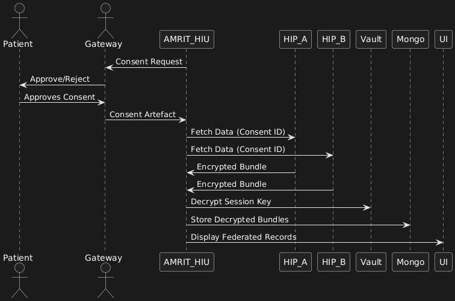

# Milestone Three (M3) - HIU Data Consumption

**Context**\
Milestone Three (M3) expanded AMRIT’s ABDM integration to act as a **Health Information User (HIU)**. At this stage, AMRIT could initiate consent requests, persist artefacts, fetch encrypted health data from multiple HIPs, decrypt and parse FHIR bundles, and present federated records inside AMRIT’s system.

The implementation is in the **Java Spring HIU Service** (`src/main/java/in/org/projecteka/hiu/*`). Core packages:

* `hiu.consent` — consent request lifecycle
* `hiu.dataflow` — health information fetch, notify/data-transfer
* `hiu.dataprocessor` — parsing and normalization
* `hiu.patient` — patient discovery and linkage

### 1. Objectives of M3

* Implement **consent lifecycle** (request → approval → artefact → notify).
* Persist consent artefacts in Postgres (`ConsentArtefact` table).
* Fetch encrypted bundles from HIPs post-consent.
* Decrypt payloads with HIU private keys (Vault).
* Parse NRCeS FHIR resources into AMRIT schema.
* Merge/reconcile data from multiple HIPs.
* Build audit logs for sandbox certification.

### 2. Architecture & System Context

#### Modules & Services

* **ConsentController.java / PatientConsentController.java**\
  → Initiates consent requests, receives consent notifications.
* **DataFlowController.java**\
  → Handles ABDM callbacks (`/data-transfer`, `onRequest`).
* **HealthInfoController.java**\
  → Exposes fetch endpoints, serves attachments, fetch status APIs.
* **ConsentService**\
  → Orchestrates consent request creation, storage of artefacts.
* **HIUFetchService**\
  → Uses artefacts to orchestrate fetches from HIPs.
* **DecryptionService**\
  → Manages private key decryption of ABDM-encrypted bundles.
* **FHIRParserService**\
  → Converts inbound bundles into NRCeS-normalized resources.
* **FederationService**\
  → Merges records across HIPs for UI display.

#### Persistence

* **Postgres (hiu-db)**: consent artefacts, linked accounts, dataflow requests.
* **Mongo (AmritHRP)**: encrypted + decrypted bundles, ABDM callbacks.
* **Vault**: HIU private keys & encryption secrets.

### 3. Consent Lifecycle

**Flow**

1. HIU → Gateway: `/consent/request` (initiated via `PatientConsentController`).
2. Gateway → Patient’s PHR app: approval prompt.
3. Patient approves → Gateway issues **Consent Artefact**.
4. ABDM → HIU: artefact delivered via `ConsentController` (`Constants.PATH_CONSENTS_HIU_NOTIFY`).
5. Artefact persisted in Postgres (`ConsentArtefact` table).
6. HIU publishes `dataFlowRequestPublisher.broadcastDataFlowRequest(...)` — kicks off fetch pipeline.

**Consent Artefact Sample**

```json
{
  "consentId": "consent-123",
  "hiTypes": ["Prescription", "DiagnosticReport"],
  "hip": ["HospitalA", "LabB"],
  "dateRange": {
    "from": "2024-01-01",
    "to": "2025-01-01"
  },
  "permission": "READ"
}

```

### 4. Data Fetch Lifecycle

**Flow**

1. HIU → HIPs: `/health-information/fetch` with `consentId`.
2. HIP → HIU: returns encrypted bundle.
3. HIU → `DecryptionService`: decrypts using Vault keys.
4. `FHIRParserService`: parses bundle into normalized schema.
5. Persisted in Mongo (`Clinical_Data_Higher_HealthCare_Center`).
6. Displayed in AMRIT UI grouped by HIP and timestamp.

**Controllers**

* **HealthInfoController.java**
  * `GET API_PATH_GET_INFO_FOR_SINGLE_CONSENT_REQUEST` — fetch by consentId.
  * `POST API_PATH_FETCH_PATIENT_HEALTH_INFO` — bulk fetch.
  * `GET API_PATH_GET_ATTACHMENT` — serve attachments.
  * `POST API_PATH_GET_HEALTH_INFO_STATUS` — check fetch status.
* **DataFlowController.java**
  * `POST PATH_DATA_TRANSFER` — handles `/data-transfer` from HIP.
  * `POST PATH_HEALTH_INFORMATION_HIU_ON_REQUEST` — handles `onRequest`.

### 5. Database Entities

#### Postgres Tables (via Liquibase/db-init.sql)

* **ConsentArtefact**
  * `id`, `artefact_id`, `artefact_json`, `signature`, `status`, `consent_manager_id`
* **LinkedAccounts**
  * `link_reference_number`, `consent_manager_id`, `patient_reference_number`, `care_contexts`
* **LinkEnquiries**
  * Discovery/on-link enquiries triggered during HIU flows

#### Mongo Collections

* **NDHMResponses**\
  → ABDM responses for consent + dataflow.
* **Clinical\_Data\_Higher\_HealthCare\_Center**\
  → Bundles fetched from HIPs, encrypted + decrypted. Indexed by consentId + visit.
* **PatientCareContexts**\
  → Extended to reflect external HIP care contexts.

### 6. Decryption Pipeline

**Process**

1. HIP encrypts payload with HIU’s **public key** (fetched via Gateway).
2. HIU receives encrypted FHIR bundle → `DecryptionService`:
   * Uses Vault-stored private key to decrypt session key.
   * Session key used to symmetrically decrypt payload.
3. Decrypted JSON validated and persisted.

**Error Handling**

* Expired key → refresh public key from Gateway.
* Invalid signature → reject bundle.
* Payload corrupt → log + skip.

### 7. Parsing & Federation

**Parsing**

* `FHIRParserService` parses bundles into AMRIT’s normalized schema.
* Supports NRCeS resources: `Observation`, `Condition`, `MedicationRequest`, `DiagnosticReport`.
* Handles optional fields gracefully.

**Federation**

* `FederationService` merges bundles across HIPs:
  * Deduplication via patient identifiers.
  * Conflict resolution (latest timestamp wins, but all history preserved).
* Records displayed grouped by HIP + timestamp.

**UI Example**

* Hospital A → OP consult (2024-09-12), prescription (2024-09-13)
* Lab B → diagnostic report (2024-09-15)

### 8. Sequence Diagram

<figure><figcaption></figcaption></figure>

### 9. Error Handling & Edge Cases

* **Expired artefact** → blocked fetch.
* **Revoked consent** → bundles auto-deleted.
* **Partial HIP responses** → displayed with HIP source labels.
* **Decryption errors** → logged; payload dropped.
* **Schema mismatches** → invalid FHIR stored raw in Mongo.

### 10. Repo / Service Mapping

**Controllers**

* `ConsentController.java` → receives artefacts, `/consents/notify`
* `PatientConsentController.java` → initiates consent requests
* `DataFlowController.java` → `/data-transfer`, onRequest
* `HealthInfoController.java` → fetch info, serve attachments
* `PatientController.java` → `/patients/on-find`

**Services**

* `ConsentService` → consent lifecycle
* `HIUFetchService` → fetch orchestration
* `DecryptionService` → key mgmt + decryption
* `FHIRParserService` → parse FHIR bundles
* `FederationService` → merge, dedupe

**DB**

* **Postgres**: ConsentArtefact, LinkedAccounts, LinkEnquiries
* **Mongo**: NDHMResponses, Clinical\_Data\_Higher\_HealthCare\_Center, PatientCareContexts
* **Vault**: private key mgmt
