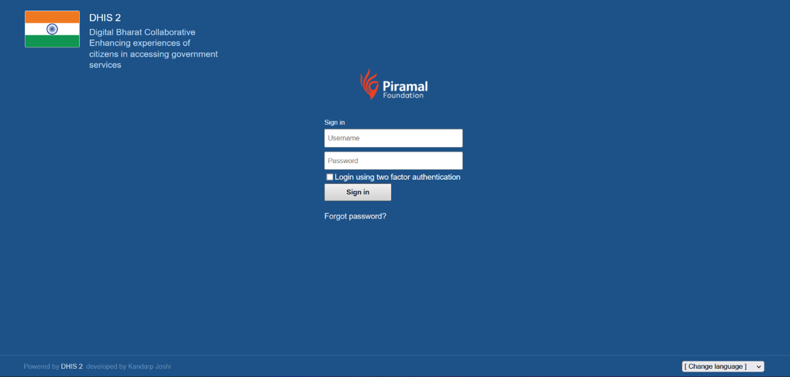
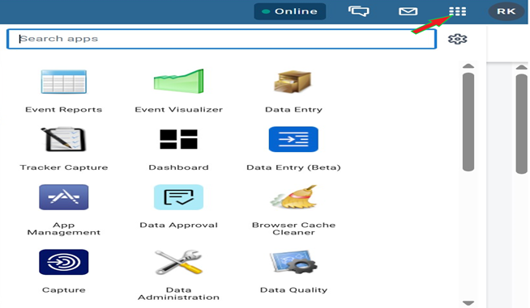
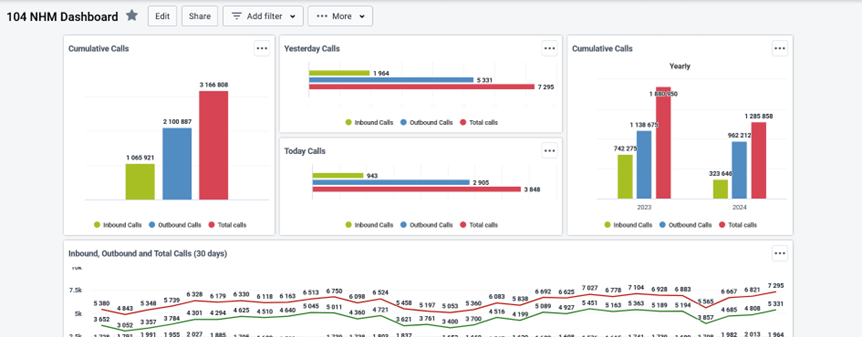
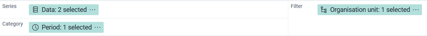

# DHIS2 Style Guide

## Major Components of a Dashboard

### 1. Header

#### 1.1 Purpose

The header provides navigation and branding elements, ensuring recognition and clarity of dashboard purpose.

#### 1.2 Login Page

- **Organization/Project Logo:**  
  - Place the logo at the top left corner.
  - Customize this by clicking the "9 dotted" menu → System Settings → Appearance tab. Here you can also set a customized footer text.

#### 1.3 Dashboard Level

- **Online/Offline Indicator:**  
  - Shows if DHIS2 is connected to the internet.
- **Interpretation and Message/Notification Button:**  
  - Displays alerts or announcements for urgent information.
- **9-Dotted Menu Button:**  
  - Access to apps like Data Entry, Visualizer, etc.

- **All the dashboards you create can be viewed in the second top panel.**
- **Click on the '+' sign to create a new dashboard.**

---

## 2. Dashboard Content Area

### 2.1 Edit Option

- **Set Dashboard Title:**  
  - Name your dashboard.
- **Customize Layout:**  
  - Resize and arrange charts.
  - Choose between:
    - **Free Flow:** Items can be placed anywhere, at any size.
    - **Fixed Columns:** Items are automatically placed within fixed, horizontal columns (number of columns can be adjusted, but not the size).

### 2.2 Share Option

- **Define who can access or modify the dashboard.**
- **Access Levels:**
  - No access
  - View only
  - View and edit

#### Example: Dashboard Sharing

| User or group | Access level |
|---------------|--------------|
| All users     | View only    |

### 2.3 Add Filter Option

- **Apply filters across all visualizations:**
  - Time period
  - Organization unit
  - Other dimensions

### 2.4 More Option

- **Enable offline access**
- **Print the dashboard**
- **Star/Unstar (favorite/unfavorite)**
- **View/hide the description of the dashboard**

### 2.5 Dashboard Visualization Area

- **Visualizations:**  
  - Charts, tables, graphs, and other relevant information.
- **Suggestions:**  
  - Based on your most viewed dashboards.
- **Click any dashboard to open and view contents.**

### 2.6 Creating a New Dashboard

- **Click the '+' button on the top panel.**
- **Provide:**
  - Dashboard title
  - Code (optional)
  - Description (optional)
  - Choose layout type

- **Use the search bar to locate existing visualizations.**
- **Click Insert to add a chart.**
- **Choose to insert at the Start or End of the dashboard.**
- **Click Save Changes to save the dashboard.**

> **Note:** Charts are displayed as cards in a grid, which can be arranged and resized based on visual preferences.

---

## 3. Font Size and Style Recommendations

- **Font size and style are mostly static in DHIS2.**
- **Customization is available for labels and titles in Data Visualizer:**
  - Go to the Options menu in Data Visualizer.
  - Click the 'Style' tab.

### Font Size Options

- Extra Small
- Small
- Regular
- Large
- Extra Large

### Font Style

- **Text alignment:** Left, right, center
- **Color, bold, italic**

### Number Formatting

| Digit group separator |
|----------------------|
| Comma                |
| None                 |
| Space                |

> **Note:** Comma separator works for single value cards and pivot tables; others use space separator.

---

## 4. Data Visualizer App

**Key Components:**

1. **Series:**  
   - Default: Data (Y-axis)
   - Example: Count of Male and Female, NCD breakups
2. **Category:**  
   - Default: Time period (e.g., Jan, Feb, Mar)
3. **Filter:**  
   - Default: Organization unit

> **Tip:** Drag and drop to interchange positions of Series, Category, and Filter.

---

## 5. Chart Types and Best Data Elements

| Chart Type         | Description                                                                 | Best Use Case                         |
|--------------------|-----------------------------------------------------------------------------|----------------------------------------|
| Column             | Compare sizes of related elements vertically                                | Facilities, gender, NCD               |
| Stacked Column     | Compare parts of a whole against related elements vertically                | Age groups, data breakdown            |
| Bar                | Compare sizes of related elements horizontally                              | Top facilities, categorical data      |
| Stacked Bar        | Compare parts of a whole against related elements horizontally              | Proportions within a category         |
| Line               | Track or compare changes over time                                          | Trends, time series                   |
| Area               | Track or compare changes over time, area under line filled                  | Cumulative data, proportions          |
| Stacked Area       | Track or compare parts of a whole over time                                 | Cumulative breakdowns                 |
| Pie                | Compare parts of a whole at a single point in time                          | Percentage distribution (max 3-4)     |
| Radar              | Compare several items against multiple variables                            | Skills assessment, multi-attribute    |
| Gauge              | Compare a percentage indicator against a 100% scale                         | Coverage rate, single metric          |
| Year-over-Year     | Compare changes over time between multiple years                            | Progress tracking, YoY comparison     |
| Single Value       | Display a single value                                                      | Total population, calls, etc.         |
| Scatter            | View relationship between two data items                                    | Outlier detection, density            |
| Pivot Table        | View data in a manipulatable table                                          | Multi-dimensional analysis            |
| Map                | Visualize data on a map                                                     | Geographic data, facility locations   |
| Choropleth Map     | Color polygons based on data value                                          | District boundaries, thematic data    |

---

## 6. Maps

- **Base Maps:**  
  - OSM Light, OSM Detailed
  - Bing Maps (if API key is added)
- **Map Features:**  
  - Add labels, move points, set locations
  - Save, share, download as PNG
  - Use predefined legends (created in Maintenance app)

---

## 7. Data Visualizer Menu Options

- **Update:**  
  - Apply changes to visualization or data selection.
- **File:**  
  - Save, rename visualization.
- **Options:**  
  - **Lines:** Add trend, target, or base lines.
  - **Aggregation Type:** Count, average, sum, last value, min, max.
  - **Legend:** Use predefined or custom color schemes.
  - **Axes:** Custom names and scales.
  - **Series:** Integrate lines and bars, different scales.
  - **Style:**  
    - Value labels, no space between bars/columns, show series key.
    - Custom titles and subtitles.
    - Color sets (default, basic, extended, bright, dark, gray, color blind).
    - Limit min/max values.
- **Download:**  
  - Download image or data (JSON, CSV, Excel).

---
