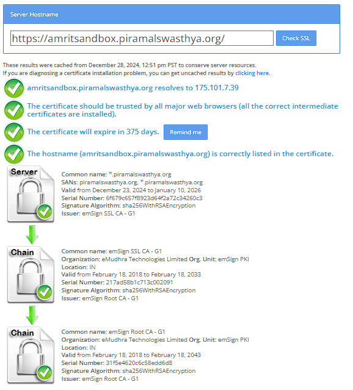

# SSL Configuration for WildFly

#### Introduction

Configuring SSL on WildFly is an essential step to ensure secure communication between clients and servers. SSL (Secure Sockets Layer) uses encryption to protect data transmitted over the network, safeguarding it from eavesdropping and tampering. By integrating SSL into your WildFly application server, you enhance security by enabling encrypted connections that authenticate identity and encrypt data. The configuration process involves generating a certificate request, installing the intermediate and primary certificates, and updating server settings to enforce secure communication channels. This setup helps in maintaining data integrity and confidentiality for our applications.

### **Steps**

**Step1:**

Create a certificate request CSR (Certificate Signing Request) and private key.

**Step2:**

After sharing CSR file with vendor, we will get .ZIP file containing 3 certificates

·      Intermediate certificate: CA\_emSign SSL CA - G1.cer

·      Domain certificate: EndEntity\_wc.piramalswasthya.org.cer

·      Root certificate: RootCA\_emSign Root CA - G1.cer

Combine three certificates in to single cert file (<mark style="color:orange;">add each cert in new line and add empty line at the end</mark>) using notepad.

Save the certificate chain as wildcard.crt.

**Step3:**

Download and install Keystore Explorer from [here](https://keystore-explorer.org/downloads.html)

Generate \*.jks file using above two files (wildcard.crt, wildcard\_key.key)

<mark style="color:red;">Follow bellow attached pdf document</mark>



**Verify the configuration in stanalone.xml file**

* TLS BLOCK
* INTERFACES BLOCK
* SOCKET BINDING BLOCK

<pre class="language-xml"><code class="lang-xml">&#x3C;tls>
    &#x3C;key-stores>
        &#x3C;key-store name="applicationKS">
        &#x3C;credential-reference clear-text="password"/>
        &#x3C;implementation type="JKS"/>
        &#x3C;file path="wildcard.jks" relative-to="jboss.server.config.dir"/>
        &#x3C;/key-store>
    &#x3C;/key-stores>
    &#x3C;key-managers>
        &#x3C;key-manager name="applicationKM" key-store="applicationKS" generate-self-signed-certificate-host="*.piramalswasthya.org (emsign ssl ca - g1)">
        &#x3C;credential-reference clear-text="password"/>
        &#x3C;/key-manager>
    &#x3C;/key-managers>
    &#x3C;server-ssl-contexts>
    &#x3C;server-ssl-context name="applicationSSC" key-manager="applicationKM"/>
    &#x3C;/server-ssl-contexts>
&#x3C;/tls>

<strong>&#x3C;interfaces>
</strong>        &#x3C;interface name="management">
            &#x3C;any-address/>
        &#x3C;/interface>
        &#x3C;interface name="public">
            &#x3C;any-address/>
        &#x3C;/interface>
&#x3C;/interfaces>

&#x3C;socket-binding-group name="standard-sockets" default-interface="public" port-offset="${jboss.socket.binding.port-offset:0}">
        -------
        &#x3C;socket-binding name="https" port="${jboss.https.port:443}"/>
        -------
&#x3C;/socket-binding-group>
</code></pre>

**Step 5:**

Stop wildlfy and then stop redis

Update the jks file under wildlfy configuration folder.

Start redis and then start wildfly.

**Step 6:**

Verify the SSL from [**ssl checker**](https://www.sslshopper.com/ssl-checker.html#hostname=https://amritsandbox.piramalswasthya.org/)

<figure><figcaption></figcaption></figure>
