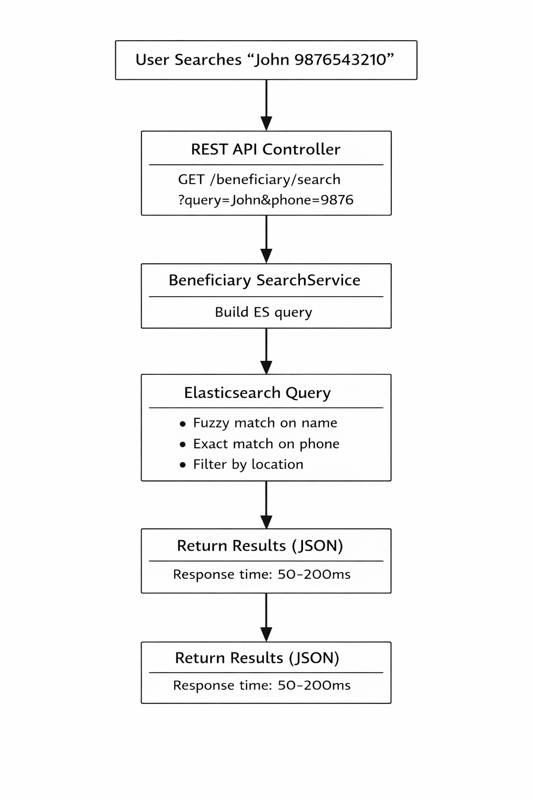

# Elasticsearch

### Overview 

The Elasticsearch implementation provides a high-performance search solution for beneficiary data. It enables fast, fuzzy, and flexible searching across millions of beneficiary records with sub-second response times.

#### Key Features 

* **Lightning-fast search**: Sub-second queries even with millions of records
* **Fuzzy matching**: Find beneficiaries even with spelling mistakes
* **Flexible filtering**: Search by multiple criteria simultaneously
* **Real-time sync**: Automatic indexing when beneficiaries are created/updated
* **Scalable**: Handles growing data volumes efficiently

### Why Elasticsearch? 

#### Business Problem 

The existing database search was experiencing performance issues:

* **Slow queries**: Complex searches taking 5-15 seconds on large datasets
* **Limited fuzzy matching**: Exact matches required, causing missed results
* **Database load**: Heavy search queries impacting transactional operations
* **Poor user experience**: Users waiting too long for search results

<figure><figcaption>
Real-time Indexing Flow (Create/Update Beneficiary)
</figcaption></figure> <figure><figcaption>
Search Flow
</figcaption></figure>

### Prerequisites 

* Java **(Elasticsearch 8.x comes with bundled JDK – no separate Java install required)**
* Minimum **4 GB RAM** (recommended)
* Database with beneficiary data
* Open ports: **9200 (HTTP)**, **9300 (Transport)**

 
