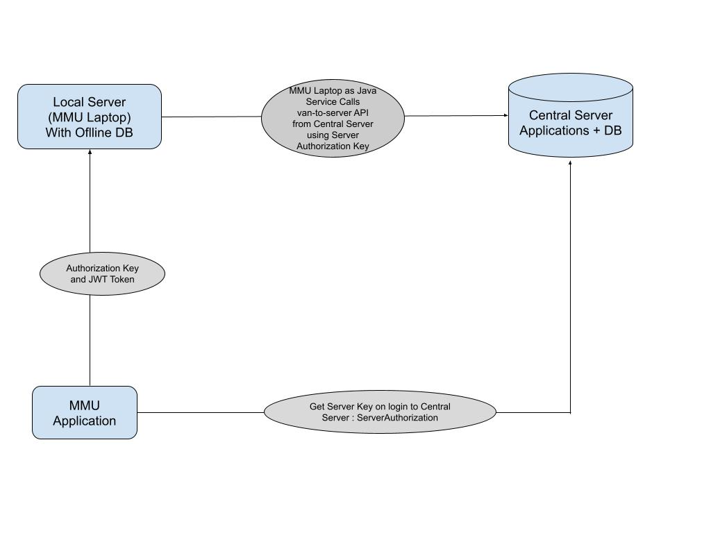

# MMU Offline Setup

### Why We Use MMU Offline Setup

The **Mobile Medical Unit (MMU) Offline Setup** is designed to operate in rural and remote areas where internet connectivity is **unstable or unavailable**.

* In such conditions, the MMU team continues to provide medical services without relying on real-time connectivity.
* All data (beneficiary registration, visit details, medical records, etc.) is stored **locally** on the MMU laptop/server (WildFly + Offline Database).
* Once the MMU team returns to an area with network access, the data is **synchronized securely** with the Central System.

This ensures:

* **Uninterrupted medical services** in the field.
* **Centralized reporting and analytics** after synchronization.

***

### MMU Offline → Online Sync Process

When MMU laptops operate offline, all beneficiary and medical data is stored locally.\
Once connectivity is restored, the laptop synchronizes data with the Central Server in **both directions**.

The sync process consists of three key parts:

***

#### 1. Data Upload (Local → Central)

**Purpose:** Push all beneficiary and visit data collected offline into the Central Server database.

**Process:**

* The sync logic checks a control table called **`synctabledetail`**, which groups local tables into **9 categories** for upload.
* Each category is processed, and corresponding data is sent to the Central Server.
* Data upload is done via the **`/van-to-server` API**.
* Each API call includes a **ServerAuthorization key** for secure access.

***

#### 2. Data Download (Central → Local)

**Purpose:** Pull updated records from the Central Server into the MMU laptop for continued offline use.

**Process:**

* The control table **`m_downloadmasters`** maintains the list of tables that need to be downloaded.
* For each table, two timestamps are compared:
  * **LastDownloadDate** → Last time the laptop synced this table.
  * **LastModDate** → Last time the table was updated on the Central Server.
* If **LastModDate > LastDownloadDate**, new/updated data is available.
* The laptop fetches records from the **`/server-to-van` API**.
* Retrieved data is stored in the **local database**.

***

#### 3. Beneficiary Registration ID (BenGenID) Generation

**Purpose:** Ensure unique beneficiary IDs across the entire MMU system.

**Process:**

* **Beneficiary Registration IDs (BenGenID)** are always generated **centrally** (not locally).
* During sync, the laptop requests new IDs from the Central Server.
* The generated IDs are downloaded and stored locally.
* These IDs are linked with the beneficiary records in the offline database.

***

This flow ensures **data consistency**, **unique identification**, and **uninterrupted healthcare delivery** in remote areas.\
\

<figure><figcaption></figcaption></figure>
